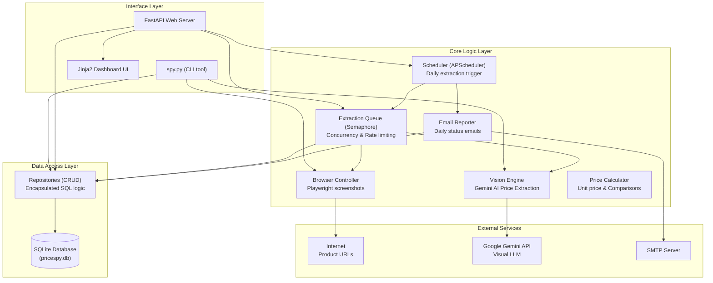
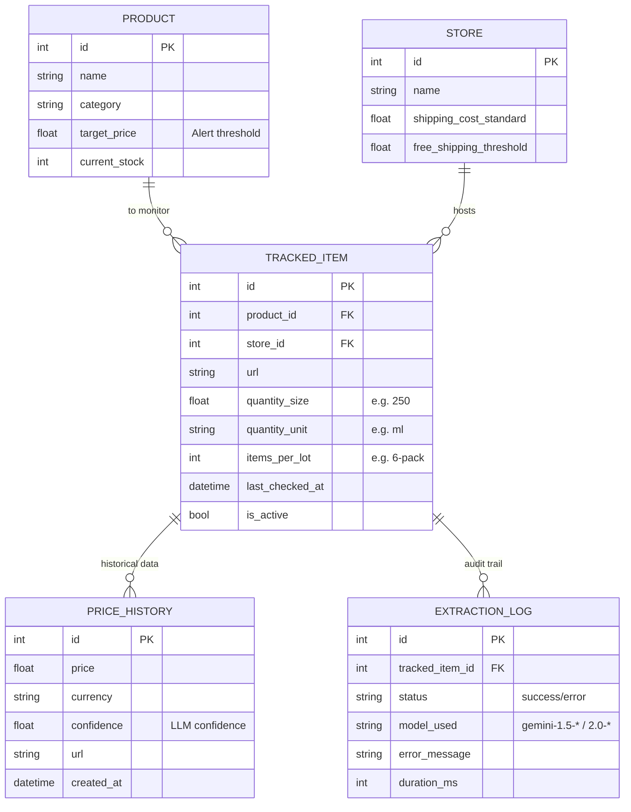
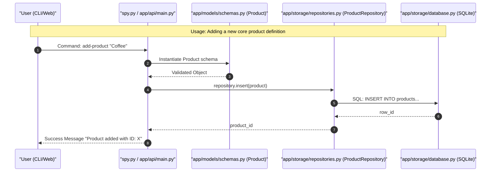
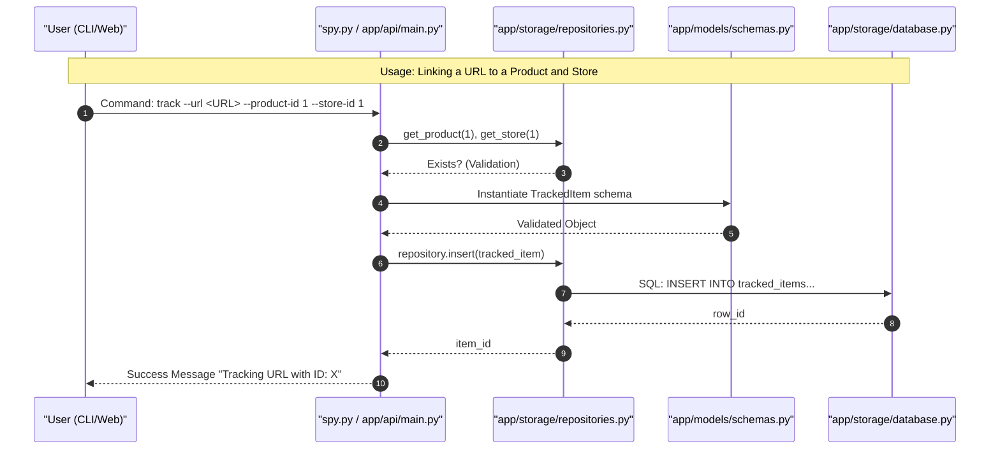
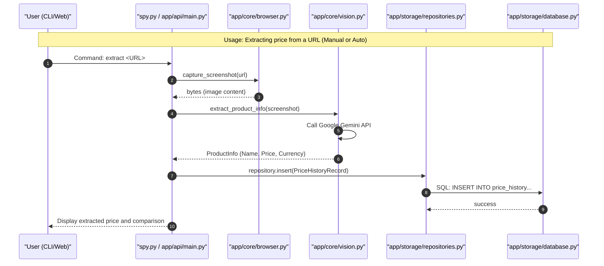

# Price Spy Codebase Visual Tutorial

This guide uses Mermaid diagrams to visualize the architecture, data models, and core usage flows of the Price Spy application.

## 1. System Architecture
This high-level view shows the layers of the application and how they interact with external services.



## 2. Data Model (ER Diagram)
The database structure is centered around products and stores linked by tracked items.



## 3. Usage Flows

### Adding a New Product
This sequence diagram shows the layers touched when creating a new core product definition.



### Tracking a New URL
Linking a specific URL to a product and store.



### Price Extraction Flow (Simplified)
The core logic of the application: Browser automation -> Vision AI -> Database storage.



### Detailed Price Extraction Lifecycle
A deep dive into the functions, files, and logic phases (Optimized for Dark Mode).

```mermaid
%%{init: {'theme': 'dark', 'themeVariables': { 'primaryColor': '#1f2937', 'primaryTextColor': '#f3f4f6', 'primaryBorderColor': '#374151', 'lineColor': '#9ca3af', 'secondaryColor': '#111827', 'tertiaryColor': '#1f2937' }}}%%
sequenceDiagram
    autonumber
    
    participant U as "User (CLI/Web)"
    participant Spy as "spy.py"
    participant Browser as "app/core/browser.py"
    participant Vision as "app/core/vision.py"
    participant Gemini as "Google Gemini API"
    participant Calc as "app/core/price_calculator.py"
    participant Repo as "app/storage/repositories.py"
    participant DB as "app/storage/database.py"

    Note over U, DB: Core Journey: Extracting Price from a product URL

    U->>Spy: main() -> cmd_extract(url)
    
    rect rgb(45, 45, 45)
        Note right of Spy: Phase 1: Browser Automation
        Spy->>Browser: capture_screenshot(url)
        Browser->>Browser: async with async_playwright()
        Browser->>Browser: page.goto(url, wait_until='networkidle')
        Browser-->>Spy: returns screenshot (bytes)
    end

    rect rgb(30, 40, 60)
        Note right of Spy: Phase 2: AI Vision Extraction
        Spy->>Vision: extract_with_structured_output(screenshot_bytes, api_key)
        Vision->>Vision: _call_gemini_api(bytes, config)
        Vision->>Gemini: POST /v1beta/models/gemini-1.5-flash:generateContent
        Gemini-->>Vision: returns JSON string
        Vision->>Vision: ExtractionResult.model_validate_json(text)
        Vision-->>Spy: returns (ExtractionResult, model_used)
    end

    rect rgb(30, 60, 40)
        Note right of Spy: Phase 3: Data Processing & Growth
        Spy->>Repo: TrackedItemRepository.get_by_url(url)
        Repo-->>Spy: returns tracked_item data (if any)
        
        Spy->>Calc: calculate_volume_price(price, lot, size, unit)
        Calc-->>Spy: returns unit_price (e.g. 0.45/100ml)
        
        Spy->>Repo: PriceHistoryRepository.get_latest_by_url(url)
        Repo-->>Spy: returns previous_price_record
        
        Spy->>Calc: compare_prices(current, previous)
        Calc-->>Spy: returns PriceComparison (drop detection)
    end

    rect rgb(60, 30, 30)
        Note right of Spy: Phase 4: Persistence
        Spy->>Repo: PriceHistoryRepository.insert(PriceHistoryRecord)
        Repo->>DB: execute("INSERT INTO price_history...")
        DB-->>Repo: row_id
        
        Note right of Spy: Phase 5: Feedback
        Spy-->>U: Print: Product Name, Price, Unit Price, Price Drop?
    end
```



## How to use

If you have the **Mermaid** extension installed in VS Code, these diagrams will render directly in the Markdown preview. You can also copy the ` ```mermaid ` blocks into the [Mermaid Live Editor](https://mermaid.live/).
